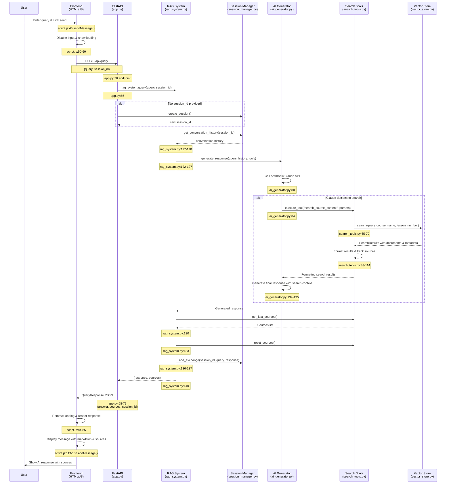

# RAG Chatbot Query Flow Diagram

## Key File Locations

### Frontend Components
- **HTML Interface**: `frontend/index.html:62` (input field)
- **JavaScript Handler**: `frontend/script.js:45` (sendMessage function)
- **API Communication**: `frontend/script.js:63-72` (POST request)
- **Response Rendering**: `frontend/script.js:113-138` (addMessage function)

### Backend Components
- **API Endpoint**: `backend/app.py:56` (/api/query route)
- **RAG Orchestrator**: `backend/rag_system.py:102` (main query method)
- **AI Processing**: `backend/ai_generator.py:43` (generate_response)
- **Tool Execution**: `backend/search_tools.py:52` (CourseSearchTool.execute)
- **Vector Search**: `backend/vector_store.py` (semantic search)
- **Session Management**: `backend/session_manager.py` (conversation history)

## Data Flow Summary

1. **User Input** → Frontend captures and validates
2. **HTTP Request** → POST to `/api/query` with query and session
3. **Session Handling** → Create or retrieve conversation context
4. **AI Processing** → Claude decides whether to search course content
5. **Tool Execution** → Semantic search through vector store if needed
6. **Response Generation** → AI synthesizes answer with search results
7. **Source Tracking** → Collect and format source references
8. **Session Update** → Store conversation for context
9. **API Response** → Return structured JSON with answer and sources
10. **Frontend Rendering** → Display formatted response with markdown and sources